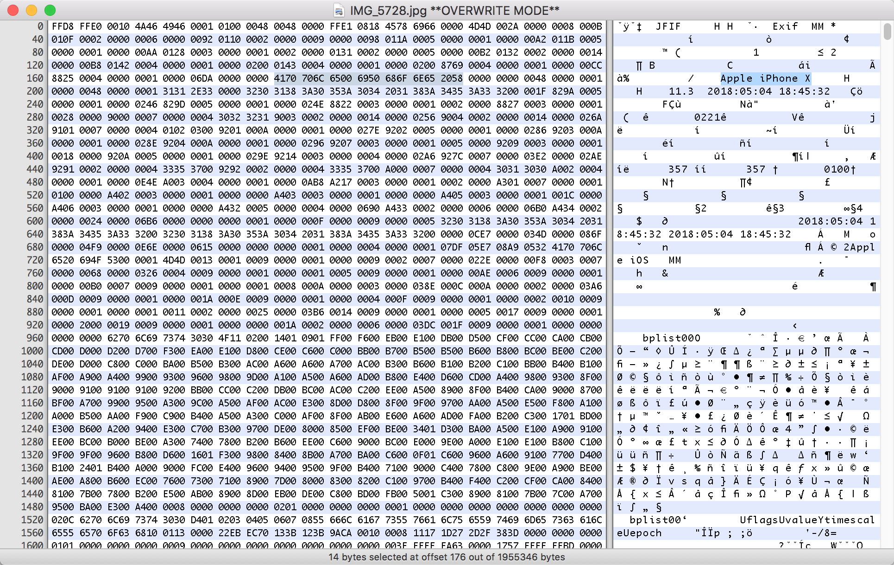
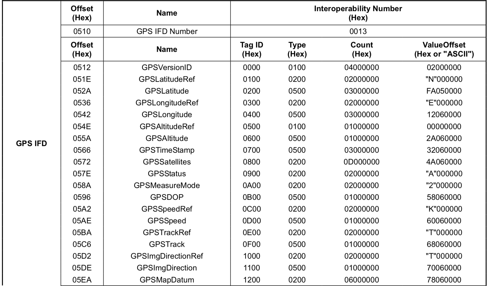
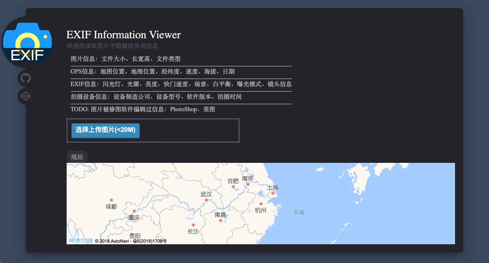

# EXIF - 隐藏在图片中的重要信息
Feei <feei#feei> 05/2018

EXIF指可交换图片文件格式（Exchangeable Image file Format），可以在图片中记录数码相机的相关数据，比如拍摄的设备、拍摄的参数以及地理位置等。

## 技术原理

最新的[EXIF v2.3](http://www.cipa.jp/std/documents/e/DC-008-2012_E.pdf)由CIPA(相机影像产品工业协会)和JEITA(日本电子信息技术产业协会)制定，

使用16进制编辑器（[Hex Fiend](https://ridiculousfish.com/hexfiend/)）打开一张由iPhone拍摄的图片:



右侧可以看到Apple iPhone X以及一些时间信息，翻阅[EXIF标准](http://www.cipa.jp/std/documents/e/DC-008-2012_E.pdf)可以看到，`0xFFD8`为图片压缩数据的开始、`0xFFE1`为EXIF属性信息、`0xFFE2`为EXIF扩展信息、`0xFFD9`为压缩数据的结尾。


根据上面结构图可以看到主要内容分为几块：

- 0th IFD：主要的图片数据
- Exif IFD：Exif私有的一些标签数据
- GPS IFD：GPS信息
- Thumbnail Data：缩略图数据



根据标准中每项信息标记的点可以读取图片背后对应的信息。

## 技术实现

[exif-py](https://github.com/ianare/exif-py)是一个基础的EXIF解析Python模块，使用它可以方便的读取图片中的EXIF元数据。

下面是一张iPhone的全部EXIF元数据信息的中英文对照。

```python
# https://github.com/FeeiCN/EXIF
"""
''  : 为空则未想好翻译内容
None: 为None则不予显示
"""
TRANSLATE_KEY = {
    'Image Make': '机器制造',  # Apple
    'Image Model': '机器模型',  # iPhone X
    'Image XResolution': '图片分辨率(X)',  # 72
    'Image YResolution': '图片分辨率(Y)',  # 72
    'Image ResolutionUnit': '分辨率单位',  # Pixels/Inch
    'Image Software': '软件版本',  # 11.3
    'Image DateTime': '拍摄时间',  # 2018:05:04 18:45:32
    'Image TileWidth': '图片平铺宽度',  # 512
    'Image TileLength': '图片平铺长度',  # 512
    'Image ExifOffset': None,  # 204
    'Image Orientation': '图片方向',  # Horizontal (normal)
    'GPS GPSLatitudeRef': None,  # N
    'GPS GPSLatitude': 'GPS纬度(N)',  # [39, 16, 2259/50]
    'GPS GPSLongitudeRef': None,  # E
    'GPS GPSLongitude': 'GPS经度(E)',  # [99, 48, 897/25]
    'GPS GPSAltitudeRef': None,  # 0
    'GPS GPSAltitude': 'GPS高度',  # 44355/32
    'GPS GPSTimeStamp': 'GPS时间',  # [10, 45, 31]
    'GPS GPSSpeedRef': None,  # K
    'GPS GPSSpeed': 'GPS速度',  # 0(公里每小时)
    'GPS GPSImgDirectionRef': None,  # T
    'GPS GPSImgDirection': 'GPS方向',  # 7067/1037
    'GPS GPSDestBearingRef': None,  # T
    'GPS GPSDestBearing': 'GPS方位',  # 7067/1037
    'GPS GPSDate': 'GPS日期',  # 2018:05:04
    'GPS Tag 0x001F': 'GPS Tag',  # 10
    'Image GPSInfo': 'GPS信息',  # 1754
    'EXIF ExposureTime': '曝光时间',  # 1/15
    'EXIF FNumber': 'F数',  # 9/5
    'EXIF ExposureProgram': '曝光程序',  # Program Normal
    'EXIF ISOSpeedRatings': 'ISO感光等级',  # 40
    'EXIF ExifVersion': 'EXIF版本',  # 0221
    'EXIF DateTimeOriginal': '原始时间',  # 2018:05:04 18:45:32
    'EXIF DateTimeDigitized': '数字时间',  # 2018:05:04 18:45:32
    'EXIF ComponentsConfiguration': '组件peizhi ',  # YCbCr
    'EXIF ShutterSpeedValue': '快门速度',  # 3303/845
    'EXIF ApertureValue': '光圈',  # 2159/1273
    'EXIF BrightnessValue': '亮度',  # 3694/1557
    'EXIF ExposureBiasValue': '曝光补偿',  # 0
    'EXIF MeteringMode': '测光模式',  # Pattern
    'EXIF Flash': '闪光灯',  # Flash did not fire, auto mode
    'EXIF FocalLength': '焦距',  # 4
    'EXIF SubjectArea': '主体区域',  # [2015, 1511, 2217, 1330]
    'EXIF SubSecTimeOriginal': '子原始时间',  # 357
    'EXIF SubSecTimeDigitized': '子数字时间',  # 357
    'EXIF FlashPixVersion': 'FlashPix版本',  # 0100
    'EXIF ExifImageWidth': '图片宽度',  # 3662
    'EXIF ExifImageLength': '图片高度',  # 2744
    'EXIF SensingMethod': '传感方式',  # One-chip color area
    'EXIF SceneType': '场景类型',  # Directly Photographed
    'EXIF ExposureMode': '曝光模式',  # Auto Exposure
    'EXIF WhiteBalance': '白平衡',  # Auto
    'EXIF FocalLengthIn35mmFilm': '35mm胶片',  # 28
    'EXIF SceneCaptureType': '场景模式',  # Standard
    'EXIF LensSpecification': '镜头规格',  # [4, 6, 9/5, 12/5]
    'EXIF LensMake': '镜头制造',  # Apple
    'EXIF LensModel': '镜头模型',  # iPhone X back dual camera 4mm f/1.8
}
```

#### GPS坐标转换

可以看到获取到的GPS经纬度坐标是`纬度(N)[39, 16, 2259/50]`/`经度(E)[99, 48, 897/25]`格式的，格式化为度分秒则是`N39° 16′ 45.18″`/`E99° 48′ 35.88″`。

根据度分秒格式的GPS经纬度坐标可以在[在线经纬度地图](http://www.gpsspg.com/maps.htm)地图中找到所在位置，但比如在高德中则需要十进制的格式。

**度分秒转换为十进制互相转换**

根据[GPS坐标转换公式](https://en.wikipedia.org/wiki/Geographic_coordinate_conversion): `度 = 度 + 分/60 + 秒/3600`

`39 + 16/60 + 45.18/3600 = 39.279216667`/`(E)99 + 48/60 + 35.88/3600 = 99.809966667`

```python
def cover_gps(n1, n2, n3):
    # [39, 16, 2259/50]
    # [99, 48, 897/25]
    # 39 + 16/60 + (2259/50)/3600 = 39.279216667
    # 99 + 48/60 + (897/25)/3600 = 99.809966667
    return float(n1) + (float(n2) / 60) + (float(n3) / 3600)
```


**十进制坐标到实际地址位置互相转换**

- 使用[高德API接口](http://lbs.amap.com/api/javascript-api/example/geocoder/regeocoding)

#### 文件创建和修改时间

主要需要考虑的是跨平台调用，每个平台上对于文件创建时间的处理不太一致。

**文件创建时间**

- Windows：`ctime`储存文件创建时间，可以通过`os.path.getctime()`或`os.stat().st_ctime`获取。
- Unix/Mac：`ctime`储存的是文件属性或内容变化的时间，所以不能用Windows中的方法获取，可以通过`os.stat().st_brithtime`获取文件创建时间。
- Linux：目前无法获取Linux文件的创建时间。

**文件修改时间**

- 文件修改时间全平台都可以使用`os.path.getmtime(path)`

```python
import os
import datetime
import platform

def creation_date(path):
    if platform.system() == 'Windows':
        t = os.path.getctime(path)
    else:
        stat = os.stat(path)
        try:
            t = stat.st_birthtime
        except AttributeError:
            t = stat.st_mtime
    return datetime.datetime.fromtimestamp(t).strftime('%Y-%m-%d %H:%M:%S')


def modification_date(path):
    return datetime.datetime.fromtimestamp(os.path.getmtime(path)).strftime('%Y-%m-%d %H:%M:%S')
```

## 使用场景

通过一张图片可以获取到的信息：

- 图片信息：文件大小、长宽高、文件类型
- GPS信息：地图位置、地理位置、经纬度、速度、海拔、日期
- EXIF信息：闪光灯、光圈、亮度、快门速度、场景、白平衡、曝光模式、镜头信息
- 拍摄设备信息：设备制造公司、设备型号、软件版本、拍摄时间
- TODO: 图片被修图软件编辑过信息：PhotoShop、美图

**使用场景**

- 通过照片定位一个人
- 通过照片确认真实的拍摄日期
- 通过照片判断拍摄设备和拍摄参数
- 通过照片判断是否使用过修图软件

**日常场景**

- 通过微信发送照片，照片中的GPS和EXIF信息将会被微信服务端抹去，所以**不用担心在微信中发送图片导致泄露信息**。
- 通过邮件/蓝牙/FTP等方式传输，照片中的GPS/EXIF信息都将会保存。
- 通过PhotoShop修图，若**使用“储存为”则所有EXIF/GPS信息都会存在**，若**使用“储存为Web格式”则所有EXIF/GPS信息都会被抹去**。

## 开放使用

整个项目已上线（[http://exif.feei.cn](http://exif.feei.cn)），欢迎免费试用。




**参考引用**

- [EXIF标准 v2.3](http://www.cipa.jp/std/documents/e/DC-008-2012_E.pdf)
- [exif-py](https://github.com/ianare/exif-py)
- [GPS坐标格式转换公式](https://en.wikipedia.org/wiki/Geographic_coordinate_conversion)
- [高德API接口](http://lbs.amap.com/api/javascript-api/example/geocoder/regeocoding)
- [在线经纬度地图](http://www.gpsspg.com/maps.htm)
