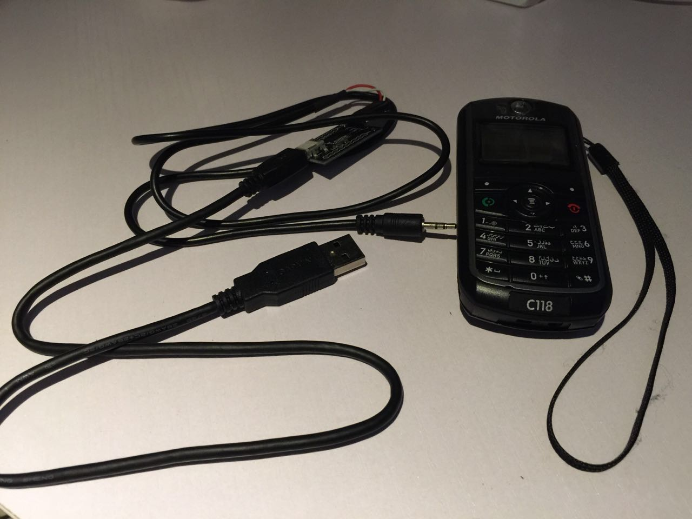
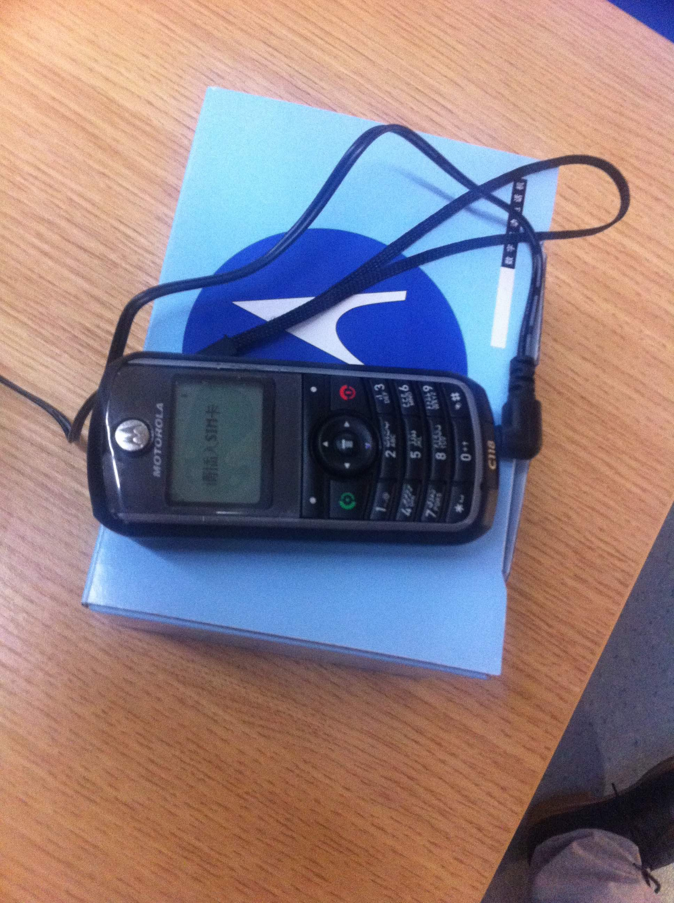
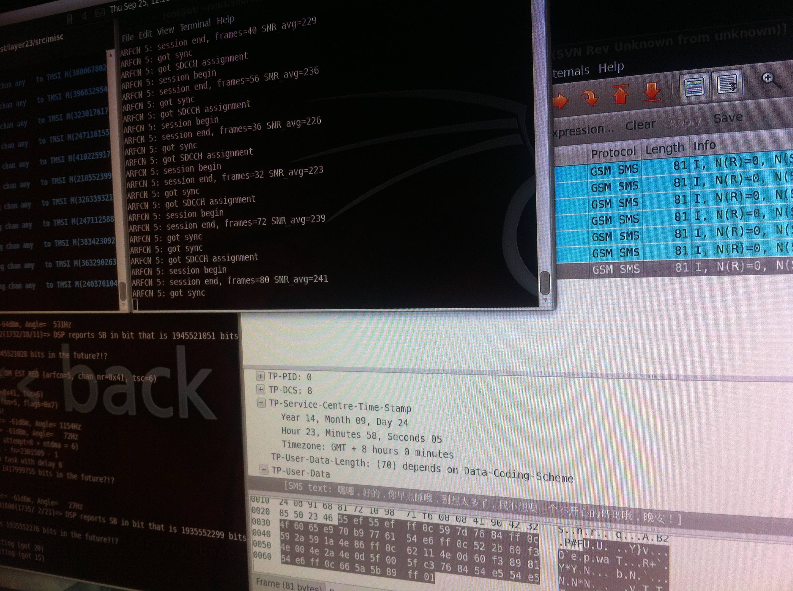

# 短信嗅探

Feei <feei#feei.cn> 09/2015

## 0x01 背景知识

短信嗅探技术在2011年就非常成熟，如今实现的成本也非常低廉，几十块的手机即可监控附近的短信息！


**短信工作原理**

2G短信的传播方式有点类似Wi-Fi，基站对应的是路由器，而我们手机对应的是电脑。
当我们手机开机时，会主动搜索附近的基站信息，并根据SIM卡选择对应的运营商基站。连上基站获取到信号后，当有短信或者电话过来时，基站是通过广播的方式发给附近的所有人，但我们手机会有一道验证过程，这个过程会保证我们只能收到自己手机号的短信和电话。
如果我们绕过这道逻辑，便可以监控经过这个基站的所有短信和电话了。那我们如何绕过手机的这道验证呢，已经有一套成熟的开源解决方案了。

**GSM加密算法**

GSM加密采用A5算法，A5算法1989年由法国人开发，是一种序列密码，它是欧洲GSM标准中规定的加密算法，专用于数字蜂窝移动电话的加密，用于对从电话到基站连接的加密。A5的特点是效率高，适合硬件上高效实现。
A5发展至今，有A5/1、A5/2、A5/3、A5/4、A5/5、A5/6、A5/7等7个版本，目前GSM终端一般都支持A5/1和A5/3，A5/4以上基本不涉及。值得注意的是，A5/2是被故意弱化强度的版本，专用于出口给友邦，2006年后被强制叫停，终端不允许支持A5/2。


**名词解释**
- MS：Mobile Station，移动终端；
- IMSI：International Mobile Subscriber Identity，国际移动用户标识号，是TD系统分给用户的唯一标识号，它存储在SIM卡、HLR/VLR中，最多由15个数字组成；
- MCC：Mobile Country Code，是移动用户的国家号，中国是460；
- MNC：Mobile Network Code ，是移动用户的所属PLMN网号，中国移动为00、02，中国联通为01；
- MSIN：Mobile Subscriber Identification Number，是移动用户标识；
- NMSI：National Mobile Subscriber Identification，是在某一国家内MS唯一的识别码；
- BTS：Base Transceiver Station，基站收发器；
- BSC：Base Station Controller，基站控制器；
- MSC：Mobile Switching Center，移动交换中心。移动网络完成呼叫连接、过区切换控制、无线信道管理等功能的设备，同时也是移动网与公用电话交换网(PSTN)、综合业务数字网(ISDN)等固定网的接口设备；
- HLR：Home location register。保存用户的基本信息，如你的SIM的卡号、手机号码、签约信息等，和动态信息，如当前的位置、是否已经关机等；
- VLR：Visiting location register，保存的是用户的动态信息和状态信息，以及从HLR下载的用户的签约信息；
- CCCH：Common Control CHannel，公共控制信道。是一种“一点对多点”的双向控制信道，其用途是在呼叫接续阶段，传输链路连接所需要的控制信令与信息。


**运行过程**
- MS（手机）向系统请求分配信令信道（SDCCH）；
- MSC收到手机发来的IMSI可及消息；
- MSC将IMSI可及信息再发送给VLR，VLR将IMSI不可及标记更新为IMSI可及；
- VLR反馈MSC可及信息信号；
- MSC再将反馈信号发给手机。
- MS倾向信号强的BTS，使用哪种算法由基站决定，这也导致了可以用伪基站进行攻击。


## 0x02 着手实践

**准备工作**

- OsmocomBB - OsmocomBB(Open source mobile communication Baseband)是GSM协议栈(Protocols stack)的开源实现。
- 电脑 - 各Linux版本都可以，这次我们选择Backtrack5
- 手机 - 我们这次选用国内最容易买到的摩托罗拉C118手机
- 耳机线
- USB2TTL线


**运行环境**

建议在BackTrack或Kali系统下操作
```bash
# 安装依赖
sudo apt-get install libtool shtool autoconf git-core pkg-config make gcc build-essential libgmp3-dev libmpfr-dev libx11-6 libx11-dev texinfo flex bison libncurses5 libncurses5-dbg libncurses5-dev libncursesw5 libncursesw5-dbg libncursesw5-dev zlibc zlib1g-dev libmpfr4 libmpc-dev  

# 下载源码
git clone git://git.osmocom.org/osmocom-bb.git  
git clone git://git.osmocom.org/libosmocore.git

# 编译libosmocore
cd ~/libosmocore  
autoreconf -i  
./configure  
make  
sudo make install

# 编译libosmocore
cd ~/osmocom-bb  
git checkout --track origin/luca/gsmmap  
cd src  
make
```

**短信截包**

将`USB2TTL`接到电脑，把耳机线一头接到手机，另外一头接到`USB2TTL`上。

```bash
# 查看手机连接状态
lsmod | grep usb

cd ~/osmocom-bb/src/host/osmocon/  
./osmocon -m c123xor -p /dev/ttyUSB0 ../../target/firmware/board/compal_e88/layer1.compalram.bin

# 再开一个终端查看可用基站
cd ~/osmocom-bb/src/host/layer23/src/misc/  
./cell_log

# 嗅探指定基站
cd ~/osmocom-bb/src/host/layer23/src/misc/  
./ccch_scan -i 127.0.0.1 -a 117

# 再开一个终端窗口查看嗅探结果
sudo wireshark -k -i lo -f 'port 4729'  
```

过滤只显示gsm_sms即可看到嗅探结果。







**参考**

- [OSMOCOMBB新手指南](http://wulujia.com/2013/11/10/OsmocomBB-Guide/)
- [OsmocomBB](http://bb.osmocom.org/trac/wiki/Hardware/Phones)
- [GSM](http://www.tutorialspoint.com/gsm/gsm_architecture.htm)
